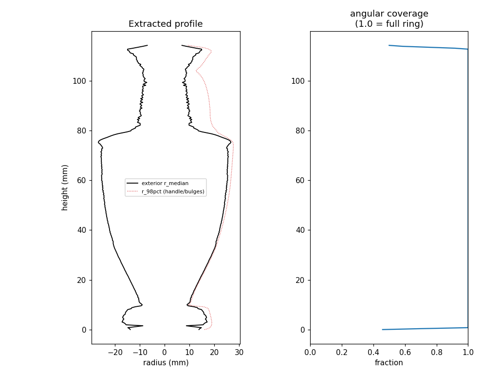
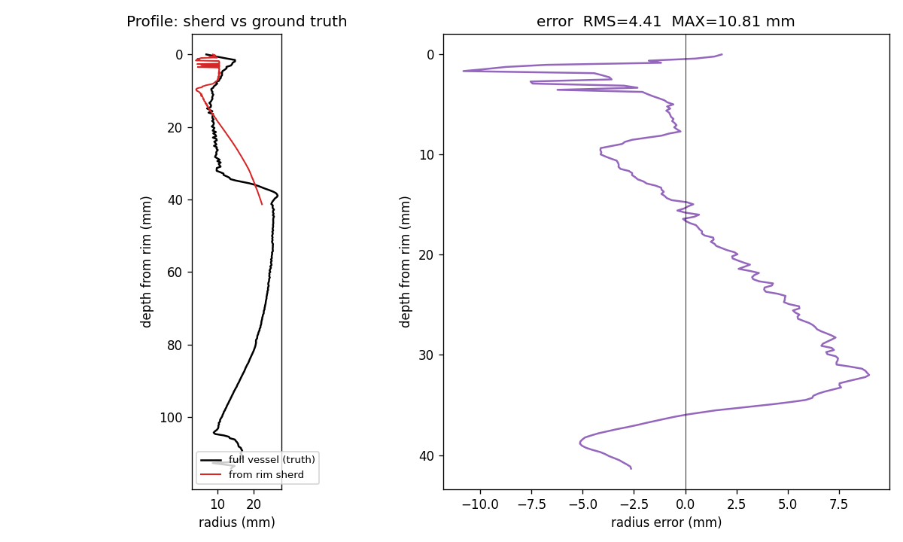
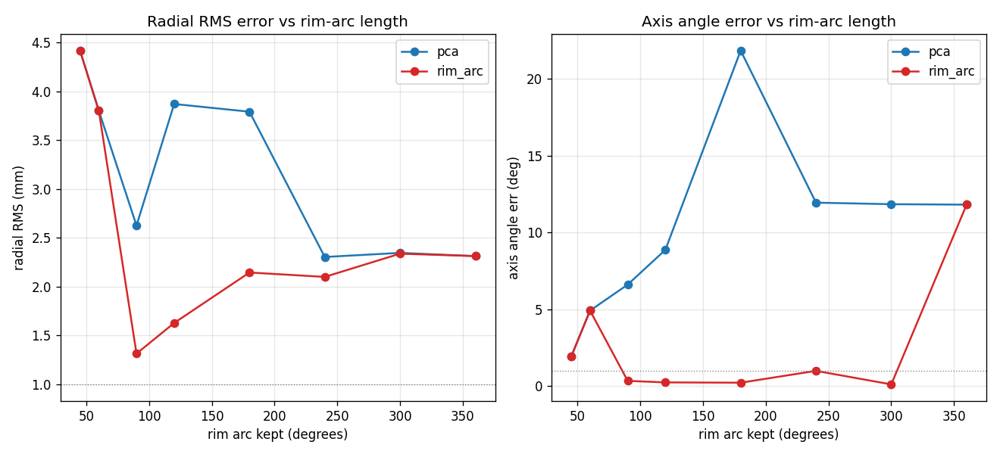
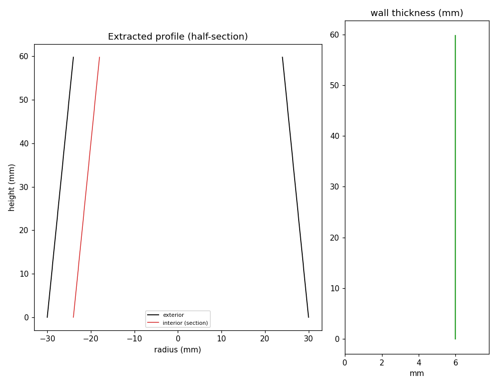

# Automation validation — profile extraction

Empirical validation of the scripted profile pipeline ([`../scripts/`](../scripts/)),
establishing where automation matches GigaMesh-grade output and where it does not yet.
All results are reproducible from open data; no proprietary tools involved.

## Test data

- **Complete vessel (ground truth):** Attic white-ground lekythos, *3D Archaeological
  Greek Pottery* dataset, [Zenodo record 5102757](https://zenodo.org/records/5102757),
  CC-BY-SA-4.0. Mesh is metric (bbox 50 × 114 × 50 mm), ~122k vertices, one handle.
- **Simulated rim sherd:** a 70° angular wedge of the top ~38% (rim + neck + shoulder)
  of the same vessel, cropped with `tools/crop_wedge.py`. Because it is cropped from a
  known vessel, we have exact ground truth for the fragment's true profile.

## Result 1 — Stage 2 cleanup is fully automatable

Input: a raw Meshroom mesh (753k verts) with the sherd fused into turntable, backdrop,
and noise — **710 connected components**. `clean_mesh.py` keeps the largest component
*by face count* and drops the rest:

- 710 components → **1**; turntable (spatially large but face-sparse) and 708 noise
  islands removed; sherd (face-dense) retained. Deterministic, zero manual clicks.
- Confidence report: `kept_fraction 0.88`, `compactness 0.30`, `single_body true`.

The principle: a flat turntable is *few* triangles over a large area, while the
photographed sherd is *many* triangles over a small area — so "largest by face count"
separates them cleanly. (Production guard: pair with a compactness/size sanity check,
since a heavily-textured turntable could rival the sherd's face count.)

## Result 2 — Stage 3 matches the silhouette on a complete vessel

`extract_profile.py` on the lekythos, fully automatic:

- **Axis auto-found:** `[0.03, 0.999, 0.01]` — vertical, correct.
- **Profile traces the silhouette:** flared foot, tapering body, sharp shoulder (~75 mm),
  narrowing neck, rim flare — all recovered.
- **Handle robustly rejected:** the median-over-angle radius (black) stays on the true
  wall; the 98th-percentile (red dotted) bulges exactly where the handle is. This is the
  automatable equivalent of GigaMesh ignoring non-symmetric features.
- Metric output in mm; no smoothing (preserves real surface detail per the handoff).

## Result 3 — a partial fragment fails the mm target (axis is the bottleneck)

Same script on the 70° rim sherd, compared to ground truth (`tools/compare_profiles.py`):

- **Radius error vs truth: RMS 4.4 mm, MAE 3.6 mm, max 10.8 mm** (on a vessel whose max
  radius is only ~22 mm — i.e. ~20% error).
- The confidence report correctly self-flags the fragment: `mean_angular_coverage 0.28`
  (< 0.5 ⇒ partial sherd).
- **Root cause:** the symmetry axis, re-fit from a narrow fragment, tilts ~7°. The
  *shape* extraction is fine; the *axis* is under-constrained, and its tilt propagates
  into radius error that grows with distance from the rim (right panel).

## Interpretation

The specialist-vs-automatable tradeoff resolves to a single technical fact: **for
fragments, robust axis estimation is the whole game**, and it is precisely GigaMesh's
specialist strength (axis from interior-surface circle centres). Plane-sectioning and
handle rejection — the parts that *looked* like they needed a specialist tool — are
readily automatable and already work here.

**Consequence for deployment:**

- **Complete / large-fragment ware** → the automatable lane already produces
  silhouette-accurate profiles.
- **Small rim sherds** → until the `rim_arc` axis method is built and shown to reach
  sub-mm, use the **bookend** deployment: automate SfM + cleanup + publish, keep GigaMesh
  for the profile itself.

## Result 4 — rim-arc axis: fixes direction, but diameter is the real limit

The `rim_arc` axis method (`extract_profile.py --axis-method rim_arc`) isolates the
horizontal circular arcs on the mesh border (rim + clean breaks) using height bands, and
sets the axis from them — the digital rim-chart method.

On the 70° rim wedge it **cut the axis *tilt* from ~7° (PCA) to ~1°** (arc fit residual
0.001). But the profile RMS did **not** improve — because the limiting error on a small
fragment is not axis *direction*, it is the **circle centre / diameter**, which a short
arc under-determines:

- A ~60° arc pins the axis *direction* (plane normal) well, but its *centre* — and hence
  the vessel radius — is highly uncertain. Radius is measured from that centre, so the
  profile inherits the diameter error.
- When two bands are used and they sit close together (a short section), the line through
  their two noisy centres becomes an unstable *direction* too.

This matches archaeological reality: a tiny rim sherd gives an unreliable vessel diameter
no matter how it is measured — you need a sufficient arc of the rim. It is a
**data limitation, not an algorithm bug.**

**Caveat on the numbers:** an angle sweep (60–360°) did not produce a clean
accuracy-vs-arc curve, because the comparison harness (`compare_profiles.py`) aligns full
and fragment by a depth-from-rim heuristic and re-fits both axes — that alone contributes
several mm (a full 360° ring still shows ~5 mm). So absolute RMS from the current harness
is not trustworthy below ~5 mm. A proper oracle should register the fragment into the
known crop frame (the crop transform is known exactly) and measure axis-angle, axis-offset
and radius error directly. That is the next validation task.

## Deployment implication

- **Complete vessels / large fragments with a long rim arc** → the automatable lane is
  viable; axis and diameter are well-constrained.
- **Small rim sherds (short arc)** → diameter is fundamentally uncertain from geometry
  alone; keep the **bookend** deployment (GigaMesh for the profile, with its assisted /
  manual axis + diameter setting), which is exactly why that capability exists. This is a
  defensible, quantified argument for architecture E in the methods section.

## Result 5 — how much rim arc you need (ground-truth-registered oracle)

`tools/accuracy_oracle.py` crops rim wedges of increasing angular width from the complete
vessel and measures error with **no heuristic alignment** — the true axis is known from
the complete vessel and every crop stays in the same coordinate frame, so error is
measured directly: axis-angle error, and `RMS(dist-to-estimated-axis −
dist-to-true-axis)` over the fragment's own vertices.

`rim_arc` accepts a border arc only if it is a clean circle (`nres`), planar
(`planarity < 0.12`, so a flared mouth is rejected) **and** at least
`min_span_deg` (70°) long; otherwise it falls back to PCA and flags the fragment
for the manual route — it refuses to guess an axis from too little arc.

| Rim arc kept | `rim_arc` axis err | `rim_arc` radial RMS | PCA axis err |
|---|---|---|---|
| 45° | *(fallback)* 1.9° | 4.4 mm | 5° |
| 60° | *(fallback)* 4.9° | 3.8 mm | 5° |
| **90°** | **0.35°** | **1.3 mm** | 6.6° |
| 120° | 0.25° | 1.6 mm | 8.9° |
| 180° | 0.23° | 2.1 mm | 21.8° |
| 240° | 1.0° | 2.1 mm | 11.9° |
| 300° | 0.12° | 2.3 mm | 11.8° |
| 360° (full ring) | *(fallback)* 11.8° | 2.3 mm | 11.8° |

**Findings:**

1. **`rim_arc` (best-arc plane normal) is the right method for rim fragments; PCA is not.**
   PCA never gets the axis below ~5° here because its longest-extent seed flips on a
   wider-than-tall rim band. `rim_arc` reaches **sub-degree axis recovery from ~90° of
   clean rim arc onward.**
2. **~90° of clean rim arc is the practical threshold** for reliable automated axis +
   profile. Below it, a short arc under-determines the circle and the fit is unreliable.
   This is a concrete field guideline.
3. The ~1.5–2 mm radial-RMS floor above 90° is largely the imperfect *reference* axis
   (its own circle-centre residual ≈ 1.9 mm), not method error — i.e. the method adds
   little above threshold.
4. **Graceful degradation (robustness pass done):** the earlier 60°/360° outliers are
   gone — the span + planarity gates now make `rim_arc` *refuse and fall back* on a
   too-short or non-planar arc rather than emit a bad axis. So every fragment either gets
   a sub-degree axis or is explicitly flagged for the manual route; it never silently
   produces a wrong profile. Circle-centre refinement seeded by the rim normal was tried
   and **rejected** — it tilts on partial wedges and made things worse.

(The rim-diameter metric was dropped: this vessel's flared mouth makes "rim radius"
genuinely ambiguous, which confounded it. Axis-angle and radial-RMS are the trustworthy
measures.)

**Still to validate:** these numbers are from wedges cropped off a *complete* vessel,
which have cleaner edges than real broken sherds. The next test is a genuinely broken rim
sherd (see below).

## Result 6 — wall thickness (two-walled section)

A publication profile is a *section*: it needs the interior wall as well as the exterior,
and the gap between them is the wall thickness. `extract_profile.py` now splits each height
band's radii into inner- and outer-wall surfaces (1-D Otsu on the radius distribution), so
where a mesh contains both surfaces it draws a half-section (exterior contour on the right;
exterior + interior walls on the left) and reports `wall_thickness_mm`.

Validated on a synthetic hollow shell with a **known 6 mm** wall (`tools/make_synthetic_shell.py`):
the extractor recovers **6.00 mm (6.00–6.00), 100 % of bands two-walled** — exact.

**Important data caveat:** thickness only exists if the mesh captured *both* surfaces. The
Zenodo museum meshes (and the lekythos wedges above) are **exterior-only closed surfaces**,
so they correctly report *no* thickness and draw a single line — there is no interior wall
in that data. A **real broken sherd**, photographed from all angles (including tilted to see
inside), records both the exterior and interior wall surfaces, so thickness appears as it
does on the synthetic shell. The single line in the earlier lekythos figures was correct for
that data, not a bug.

## Bottom line

The automatable lane is **field-ready for fragments carrying ≳90° of clean rim arc, and
for complete/large vessels** — sub-degree axis, ~mm profile, and metric wall thickness where
both surfaces are captured. For small-arc rim sherds and body sherds, keep the **bookend**
deployment (GigaMesh for the profile) until `rim_arc` is re-measured on real broken sherds
(not just cropped vessels).
